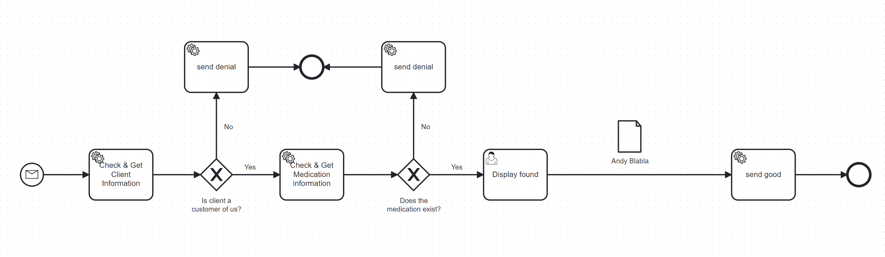
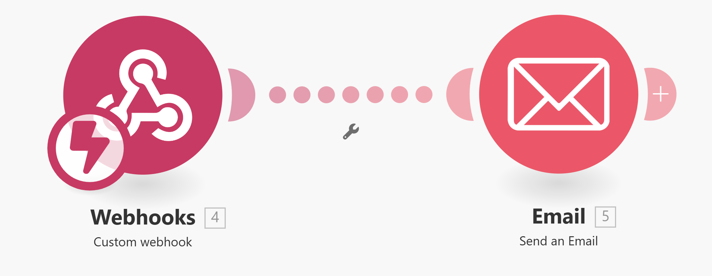

# AS24TeamPulse
**Digitalization of Business Processes in Healthcare (AS2024) - Project**

## Authors
|**Name**|**Email**|
|---|---|
|Andreas Braun Ponce de Leon|andreas.braunponcedeleon@students.fhnw.ch|
|Jetlinda Krasniqi|jetlinda.krasniqi@students.fhnw.ch|
|Joëlle Höchle|joelle.hoechle@students.fhnw.ch|
|Nicolas Bopp|nicolas.bopp@students.fhnw.ch|

## Supervisors
|**Name**|**Email**|
|---|---|
|Andreas Martin| andreas.martin@fhnw.ch|
|Charuta Pande |charuta.pande@fhnw.ch|
|Devid Montecchiari |devid.montecchiari@fhnw.ch|

## Project Description
As an Swiss healthare insurance we automate the process of medication invoices reciving and processing. It includes the extraction of invoices from email attachments and checking diffrent conditions for the payment approval or denial.

## AS-IS Process

### Goal
The goal of this project is to make a faster and automized process of payment denials or approvals and calculations of medications.

### Stakeholders
Main Stakeholders in this project are Swiss healthcare insurance, which profits from automatization of diffrent tasks. Additionally, the client of the healthcare insurance is also benefitting, as they got faster feedback about their medication invoices and a better overview of the calculations and the payments.

### User Stories/ Scenario/ case
The healthcare insurance company receives invoices as an pdf attached to the email

## Tools used:
- make.com (for automation)
- camunda
- deepnotes.com
- Google Mail
- Google Drive
- Google Cloud Platform
- Python
- Flask (for API/webhook integration)
- SQLite (database)
- PDF.co

The Links to the used projects for the tools are listed below:

## Knowledge Base
https://www.gs1.ch/en/industries/healthcare/pharmaceuticals

https://www.bag.admin.ch/bag/en/home/versicherungen/krankenversicherung/krankenversicherung-leistungen-tarife/Arzneimittel.html

## Setup Instructions
Step-by-step guide to set up the project locally:
- Run Deepnote -> LINKKKKKKKKKKK
- Send empty email with an PDF invoice to the address digitbp.pulse.team@gmail.com with an PDF attachement of an Swiss invoices from Tarmed (invoices are provided in **LINK!!!!!!!!!!!!!!**)
- Deploy Camunda

## TO-BE Process

### Features
Key functionalities:
- Automatically fetches invoices from email attachments.
- Reads and parses text from invoice PDFs to JSON objects using PDF.co.
- API for sending invoice data to camunda
- Stores data from patient, invoices and medications in a structured SQLite database.
- Storage of medication invoice in PDF format in Google Drive
- Supports integration with external systems like Deepnote and Make.com for automated workflows

### Roles

### Automated Workflow
In [Figure 1](#figure-1) the automated workflow in make.com is visualized, including the modules. The process starts with the Gmail module monitoring incoming emails, receive them and the workflow iterates through its attachments, using a filter, which only let files with the endings '.pdf' pass the workflow.
The PDF Files are routed to two actions, first uploaded directly to the digitbp.pulse.team@gmail.com Google Drive storage, and the other path sends the PDF file to the PDF.co module. This module converts the information in the PDF file to a JSON format, which is then passed to the JSON module to make an JSON object out of these information, which is suitable for being sent to an API using the HTTP post request module.

<figure>
  
  <figcaption>Figure 1: Screenshot of the used modules in make.com</figcaption>
</figure>

The API extract the information from the JSON object and creates an entry in the Invoice table. The extracted values from the JSON object are then send to the Camunda endpoint, which starts the camunda process. 

<figure>
  
  <figcaption>Figure 2: PLACEHOLDER !!!!!!!!!!!!!!!!!!!!!!!!!!!!!!!!!!!!!!!!!!!!!!!!!!!!! </figcaption>
</figure>

 The BPMN process in [Figure 2](#figure-2) describes a decision making process for medication cost approval or denial. After receiving the information of the invoice from the API as JSON objects, the system checks if the client is a client from our healthcare insurance. If not, the client gets an denial generated by an Large language model. If the client is in our database, the information about the medication is fetched from the Medication table and checks if the medication exists. Also here a denial is generated with an LLM if this doesn't exist and if yes the process proceed to display the information. 
 
 OVERVIEW THIS:.........................
 For calculating the risk-benefit of the cost approval for the medication, and if the invoice is reasonable, the information undergoes an [Decision Table](#decision-table) to automate this task. If there is an high risk, the task is going to proceed to an higher authority, which checks the case manually and decide if the cost is approved or denied, with an LLM generated letter to the client. If the higher authority finds the invoice for reasonable or the decision is a low risk, the system sends a positive response generated by the LLM before ending.

### Database
For this project, the medical billing and insurance management system, designed specifically for the Swiss healthcare environment, is represented in three tables, which are depicted in [Figure 3](#figure-3). The first table on the left describes the Medication table, which stores details about medications, including a unique identifier (GTIN), manufacturer, description, substances, public price, and a drug abuse risk indicator. Using the GTIN number, the Invoice table in the middle links to the Medication table. This table records invoice data, such as a unique invoice ID, an insurance number, a medication identifier, the date, the biller’s email, and the total amount. The Clients table on the right is linked to the Invoice table via the insurance number and holds information about the client, including first and last names, address details, email, and a risk score.

<figure>
  
  <figcaption>Figure 3: Screenshot of the created database in the project with SQLite. </figcaption>
</figure>

### Decision Table

### LLM Generated Letters
If the process decides to approve the costs of the medication invoice, a Large Language Model (LLM) will generate an approval letter and send it via an API to Make.com, which automatically sends the letter to the client's email address using the Webhooks and Email modules.

Cost approval may be denied in the following cases:
- The client is not a member of our health insurance.
- The medication does not exist in our database.
- After a high-risk detection, a higher authority decides that the cost approval is not reasonable.

In each of the above cases, an individual denial letter will be generated using the LLM, clearly stating the reason for denial. After the letter is generated as a PDF, it will be sent to an API, which forwards it to Make using the Webhooks module. The Email module will then automatically send the denial letter to the client's email address (see [Figure 4](#figure-4)).

<figure>
  
  <figcaption>Figure 4: Send email to client</figcaption>
</figure>

## Limitations
The email must be empty! -> only attachements are allowed
Due to time issues the project is limited to medication that have the Tarif 402 (GTIN code), even though tarif positions in the Tarmed system are not specifecly defined. 

## Conclusion
