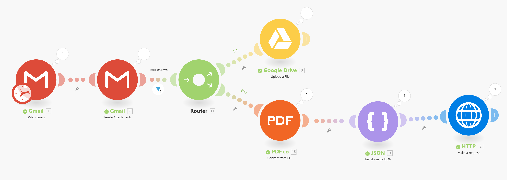

# AS24TeamPulse
**Digitalization of Business Processes in Healthcare (AS2024) - Project**

## Authors
|**Name**|**Email**|
|---|---|
|Andreas Braun Ponce de Leon|andreasbraunponcedeleon@students.fhnw.ch|
|Jetlinda Krasniqi|jetlindakrasniqi@students.fhnw.ch|
|Joëlle Höchle|joelle.hoechle@students.fhnw.ch|
|Nicolas Bopp|nicolas.bopp@students.fhnw.ch|

## Supervisors
|**Name**|**Email**|
|---|---|
|Andreas Martin| (andreas.martin@fhnw.ch)|
|Charuta Pande |(charuta.pande@fhnw.ch)|
|Devid Montecchiari |(devid.montecchiari@fhnw.ch)|

## Project Description
This project automates the extraction of invoices in PDF format from email attachments, parsing the content to **XML** data using PDF.co, and stores the invoice in the google drive account in parallell. Using an API the parsed data is sent to the **server** and stored in a database......

### AS-IS Process

### TO-BE Process

### Goal

### Stakeholders

### User Stories/ Scenario/ case

## Tools used:
- make.com (for automation)
- camunda
- deepnotes.com
- Google Mail
- Google Drive
- Google Cloud Platform
- Python
- Flask (for API/webhook integration)
- SQLite (database)
- PDF.co

The Links to the used projects for the tools are listed below:

## Knowledge Base
https://www.gs1.ch/en/industries/healthcare/pharmaceuticals?utm_source=chatgpt.com

https://www.bag.admin.ch/bag/en/home/versicherungen/krankenversicherung/krankenversicherung-leistungen-tarife/Arzneimittel.html?utm_source=chatgpt.com#-567995143

## Features
Key functionalities:
- Automatically fetches invoices from email attachments.
- Reads and parses text from invoice PDFs to **XML format** using PDF.co.
- API for sending invoice data **to the server**
- Stores data from patient, invoices and medications in a structured SQLite database.
- Storage of invoice data in Google Drive
- Supports integration with external systems like Deepnote and Make.com for automated workflows

## Setup Instructions
Step-by-step guide to set up the project locally:

Prerequisites:
Python 3.x installed.
Required Python libraries installed (e.g., fpdf, flask, sqlite3).

## Conclusion
