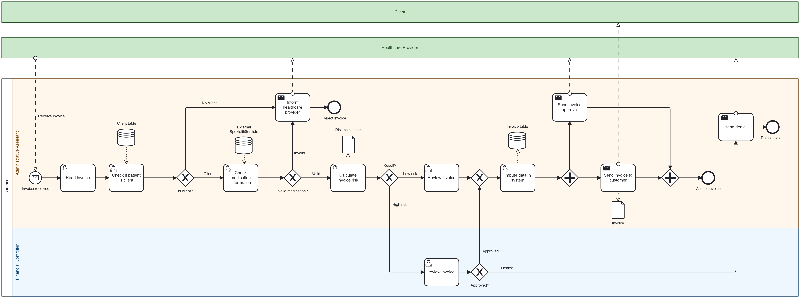
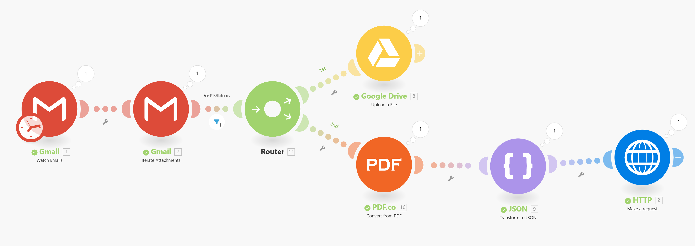
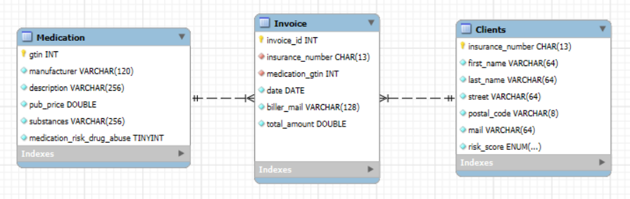
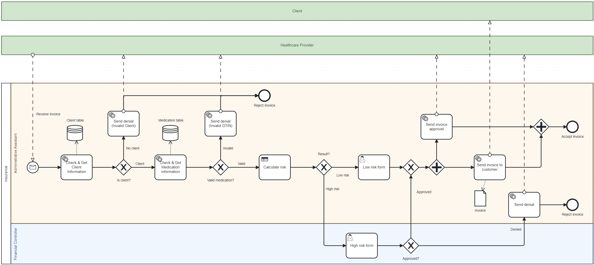
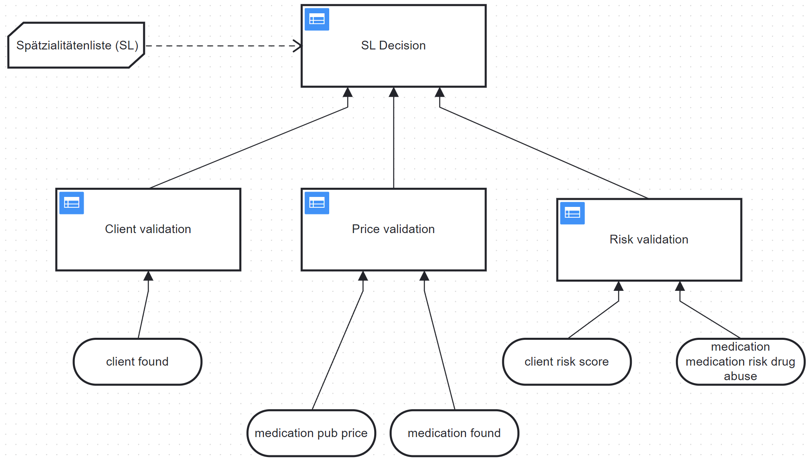
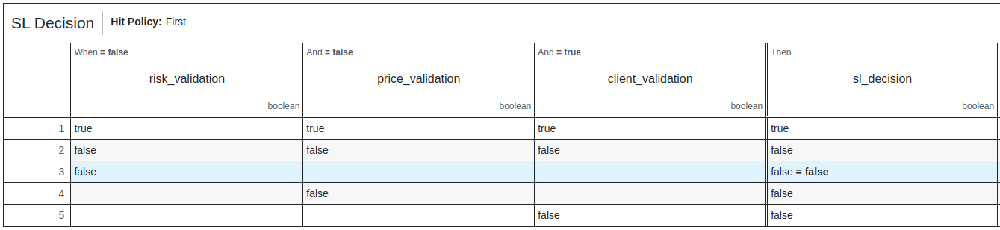
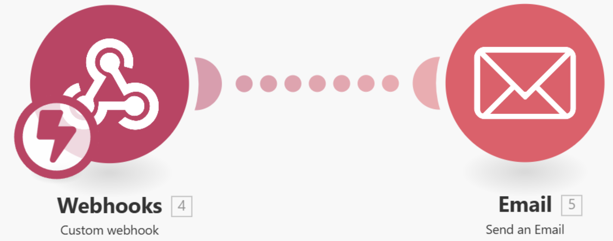

# 📄💊 AS24TeamPulse 💊📄

#### Preamble — *Project AS2024*

This project aims to explore and implement innovative solutions to streamline healthcare processes through digital transformation, leveraging modern technologies to address real-world challenges in the industry. This project was enabled by the University of Applied Sciences and Arts Northwestern Switzerland (FHNW).

<figure id = logo>
  
</figure>

 
## Authors 👨‍👨👱🏻‍♀️👩

The contributing members of the **AS24TeamPulse** team are listed in [Table 1](#authores), with their names and contact information. 

|**Name**|**Email**|
|---|---|
|Andreas Braun Ponce de Leon|andreas.braunponcedeleon@students.fhnw.ch|
|Jetlinda Krasniqi|jetlinda.krasniqi@students.fhnw.ch|
|Joëlle Höchle|joelle.hoechle@students.fhnw.ch|
|Nicolas Bopp|nicolas.bopp@students.fhnw.ch|{#authores}

## Supervisors 👩‍💼

[Table 2](#supervisors) shows the names of the supervisors who provided guidance and expertise in the context of healthcare digitalization throughout the project.

|**Name**|**Email**|
|---|---|
|Andreas Martin| andreas.martin@fhnw.ch|
|Charuta Pande |charuta.pande@fhnw.ch|
|Devid Montecchiari |devid.montecchiari@fhnw.ch|{#supervisors}

https://github.com/user-attachments/assets/82d9deff-23c5-4ab1-8135-bede661d7e56

## Table of contents
- [Project Description 👑](#project-description-)
- [AS-IS Process 🚩](#as-is-process-)
  - [Roles 🎭](#roles-)
  - [Workflow ⚡︎](#workflow-︎)
  - [Goal 🎯](#goal-)
  - [Stakeholders 💪](#stakeholders-)
  - [User Stories / Scenario / case](#user-stories--scenario--case)
    - [Assistant 👩🏼‍💻](#assistant-)
    - [Client 🙋🏻‍♂️](#client-️)
    - [Risk Management 🚩](#risk-management-)
- [TO-BE Process 🚩](#to-be-process-)
  - [Features 🧨](#features-)
  - [Receiving E-Mail with "MAKE" 📧](#receiving-e-mail-with-make-)
  - [Deepnote 📝](#deepnote-)
    - [Flask API for external service tasks 🧪](#flask-api-for-external-service-tasks-)
    - [Database ⛁](#database-)
  - [Camunda BPMN To Be Workflow 🏋](#camunda-bpmn-to-be-workflow-)
    - [Risk Assessment with Decision Table 📊](#risk-assessment-with-decision-table-)
      - [SL Decision Service 🤵](#sl-decision-service-)
        - [Decision Flow ⚙️](#decision-flow-️)
      - [Example of a high-risk decision ⚠️](#example-of-a-high-risk-decision-️)
  - [LLM Generated Letters 💬](#llm-generated-letters-)
  - [Limitations 🚧](#limitations-)
  - [Conclusion 📝](#conclusion-)
  - [Tools used 🔨](#tools-used-)
  - [Run the workflow ⚙️](#run-the-workflow-️)
  - [Further details 📖](#further-details-)
- [Knowledge Base 📚](#knowledge-base-)
- [Usage of AI 🤖](#usage-of-ai-)

## Project Description 👑

As a Swiss health insurance company, we automate the process of receiving and processing pharmaceutical invoices. This includes extracting invoices from email attachments and checking various conditions for payment approval or rejection. Using a large language model, the customer receives a generated decision letter that completes the process.

# AS-IS Process 🚩

The current process is very time-consuming for the administrative assistant. For each invoice, he or she has to check if the client is a customer and if the drug has a valid GTIN number. And finally, they have to do a risk assessment based on a comparison with the official 'Spezialitätenliste,' which doesn't currently have an API.

## Roles 🎭

Internal: 
- Insurance: Administrative Assistant
- Insurance: Financial Controller

External: 
- Healthcare provider
- Client

## Workflow ⚡︎

The current state of cost approval in the Swiss health insurance system includes many tasks that are not yet automated. It takes a considerable amount of time and effort to either accept or reject the process of drug cost validation. This state is modeled in [Image of the As Is Process](#asIs) and can also be found as [`bpmn-model`](bpmn\Pulse_as_is_Process.bpmn).
The process starts with the insurance company's administrative assistant receiving an email with an invoice attached. The assistant reads the invoice and checks the client table to see if the person named on the invoice is a client of the insurance company. 
The first gateway shows two different scenarios:
- If the person is not a client, the assistant informs the healthcare provider about the invalid claim, and the process ends.
- If the client exists in the table, the assistant checks the external Swiss [Spezialitätenliste](https://www.xn--spezialittenliste-yqb.ch/) for the validity of the medication. If the medicine is invalid, the healthcare provider is informed and the process ends.
For valid medicines, the process proceeds to the risk calculation stage:
- If the risk is low, the assistant checks the invoice and enters the information into the invoice table in the database.
- If the risk is high, the process moves to the Financial Controller who decides whether to approve or reject the case:
  - If approved, the invoice information is sent back to the assistant, who inserts the data into the invoice table.
  - If rejected, a message is sent to inform the provider of the rejection, and the process is terminated.

The best case is that the invoice is approved, which completes the process after notifying the healthcare provider and sending the notification and invoice to the client.

<figure id = "asIs">
  
  <figcaption>Figure 1: As-Is BPMN model of the medication cost approval in the Swiss healthcare insurance company.</figcaption>
</figure>

As described in this workflow, there are many tasks for the Assistant, which could be automated and proceed more efficient.

## Goal 🎯

The aim of this project is to create a faster and more automized process for the approval or denial of payments and the calculation of pharmaceutical invoices.

## Stakeholders 💪

The main stakeholder is our insurance company, especially the administrative assistant, who gets a lot of support in performing repetitive, boring standard tasks. In addition, the client benefits from a very fast process cycle, receiving feedback on calculations and decisions. Finally, the doctor gets quick feedback if there is an error in the invoice, with a description of the error.

## User Stories / Scenario / case

### Assistant 👩🏼‍💻

User Story 1: Administrative assistant - invoice automation
I am an administrative assistant at an insurance company,
I would like the system to automatically process medication invoices from email attachments,
so that I can save time and focus on other administrative tasks.

Acceptance criteria:

- The system retrieves email attachments and identifies valid PDF invoices.
- PDF invoices are parsed into JSON objects, extracting key fields (e.g., client ID, medication, cost).
- Invalid or incomplete invoices are flagged with a reason and a notification is sent back to the healthcare provider.

### Client 🙋🏻‍♂️

User Story 2: Client - Fast response for drug approval
As a client with health insurance,
I want to receive timely feedback on whether my medication costs have been approved or rejected,
so that I can manage my medical expenses without unnecessary delays.

Approval criteria:

- Client receive approval or denial letters via email within a pre-defined SLA (e.g., within 24 hours of invoice submission).
- Denial letters clearly explain the reason (e.g., non-member, medication not on formulary).
- Approval letters include payment details and next steps for reimbursement.

### Risk Management 🚩

User Story 3: Financial Controller - Risk Escalation Management
As a financial controller,
I want to review high-risk drug invoices flagged by the system,
so that I can make informed decisions and ensure compliance with cost approval policies.

Approval criteria:

- The system flags high-risk invoices based on pre-defined rules (e.g., risk of drug abuse, high cost).
- Financial controllers are notified and provided with all relevant invoice and medication details.
- Controllers can approve or reject the invoice, with the system generating an appropriate letter to the client.

# TO-BE Process 🚩

This chapter describes the innovations in business process automation of the To Be Process. The aim is to reduce costs and save time in the approval process of our Swiss health insurance company pulse. Provide insight into the workflow and automation of tasks. It also serves as a guide for reproducibility. 

## Features 🧨

Key features:
- Automatically retrieves invoices from email attachments.
- Reads and parses text from invoice PDFs into JSON objects
- API to send invoice data to Camunda and start the process
- Stores client, invoice, and medication data in a structured SQLite database.
- Storage of medication invoices in PDF format in Google Drive
- Supports integration with external systems such as Deepnote and make.com for automated workflows
- Generates and returns decision letters to the client

## Receiving E-Mail with "MAKE" 📧

The [image](#makeReceive) below visualizes the automated workflow in MAKE, including the modules. The process starts with the Gmail module monitoring incoming emails. Then the emails are filtered if the email attachment is a PDF. 

The PDF files are routed to two actions, firstly uploading them directly to the digitbp.pulse.team@gmail.com Google Drive storage. This is used as a database to keep track of incoming invoices. The other path sends the PDF file to the PDF.co module. This module converts the information in the PDF file to JSON format, which is then passed to the JSON module to create a JSON object suitable for sending to an API using the HTTP post request module.

<figure id = "makeReceive">
  
  <figcaption>Figure 2: MAKE workflow pipeline.</figcaption>
</figure>

## Deepnote 📝

The MAKE pipeline passes the JSON object to Deepnote with an HTTP request.
The API extracts the information from the JSON object and creates an entry in the Invoice table. The extracted values from the JSON object are then sent to the Camunda endpoint, which finally starts the Camunda [To Be](#ToBe) process. 

### Flask API for external service tasks 🧪

<table width="900" id="endpoints">
    <tr>
        <th width="30"><b>Endpoint</b></th>
        <th width="30"><b>Method</b></th>
        <th width="100"><b>Description</b></th>
        <th width="200"><b>Request Body</b></th>
        <th width="200"><b>Response</b></th>
    </tr>
    <tr>
        <td>/create_invoice</td>
        <td>POST</td>
        <td>Creates an invoice and starts a Camunda process</td>
        <td>
            <pre>
{   
    …
}
            </pre>
        </td>
        <td>
            <pre>
{
    "status": "success",
    "message": "Invoice created and process started",
    "process_instance_id": "id",
    "invoice_id": 12345678
}
            </pre>
        </td>
    </tr>
    <tr>
        <td>/check_client</td>
        <td>POST</td>
        <td>Checks if a client exists based on their insurance number</td>
        <td>
            <pre>
{
    "insurance_number": 12345678
}
            </pre>
        </td>
        <td>
            <pre>
{
    "found": true,
    "client": { ... }
}
            </pre>
        </td>
    </tr>
    <tr>
        <td>/check_medication</td>
        <td>POST</td>
        <td>Checks if a medication exists based on its GTIN</td>
        <td>
            <pre>
{
    "gtin": 7680481641027
}
            </pre>
        </td>
        <td>
            <pre>
{
    "found": true,
    "medication": { … }
}
            </pre>
        </td>
    </tr>
    <tr>
        <td>/send_email</td>
        <td>POST</td>
        <td>Sends an email based on the invoice and reason provided</td>
        <td>
            <pre>
{
    "invoice_id": 12345678,
    "reason": "reason"
}
            </pre>
        </td>
        <td>
        <pre>-</pre>
        </td>
    </tr>
</table>

### Database ⛁

For this project, the medical billing and insurance management system designed specifically for the Swiss healthcare environment is represented by three tables, which are shown in [SQLite tables](#databases). The first table on the left is the Medication table, which stores details about medications, including a unique identifier (GTIN), manufacturer, description, substances, public price, and a drug abuse risk indicator. Using the GTIN number, the Invoice table in the middle links to the Medication table. This table records invoice data such as a unique invoice ID, an insurance number, a drug identifier, the date, the biller's email and the total amount. The Client table on the right is linked to the Invoice table via the insurance number and holds information about the client, including first and last name, address details, email, and a risk score. 

<figure id = "databases">
  
  <figcaption>Figure 3: SQLite healthcare database for client records, invoicing, and medication tracking.</figcaption>
</figure>

## Camunda BPMN To Be Workflow 🏋

Finally, we arrive at the [To-Be BPMN Workflow](bpmn/Pulse_to_be_Process.bpmn) in Camunda. The start is triggered by the HTTP request from Deepnote, which introduces the model with the invoice parameter from the invoice from the email. After receiving the invoice information from the API as JSON objects, the system checks if the client is a customer of our health insurance. If the client is in our database, it retrieves the drug information from the drug formulary and checks if the drug exists.
If any of the checks fail, a rejection message is generated with an LLM giving the healthcare provider an overview of why the invoice cannot be processed. 

<figure id= "ToBe">
  
  <figcaption>Figure 4: To-Be BPMN model of the medication cost approval in the Swiss healthcare insurance company.</figcaption>
</figure>

### Risk Assessment with Decision Table 📊

There is also a risk assessment where the invoice is reviewed. To calculate the risk/benefit of approving the cost of the drug, and if the invoice is reasonable, the information goes through a [Decision Tree](#CMNiskevaluation) to automate this task (see [SL_decision.dms](bpmn/sl_decision.dmn)). If there is a high risk, the task is escalated to a higher authority who will review the case and decide whether to approve or deny the cost, with an LLM generated letter to the customer. If the higher authority finds the invoice for reasonable or the decision is low risk, the system sends a positive response generated by LLM before closing.

<figure id = "CMNiskevaluation">
  
  <figcaption>Figure 5: CMN risk evaluation.</figcaption>
</figure>

#### SL Decision Service 🤵

The DMN-based decision service for medication validation evaluates the following:
- Client eligibility and risk profile
- Price validation against published rates
- Drug abuse risk assessment

The service adheres to Switzerland's 'Spezialitätenliste' (SL) rules for medication reimbursement approval.

##### Decision Flow ⚙️

1. Ensures that the client is a valid client within the system.
1. Compares the medication price to the published rates based on the SL.
1. Assesses the risk based on the client profile and the potential for medication abuse.
1. Returns the final approval based on all validations passing.

#### Example of a high-risk decision ⚠️

The [decision table](#highRiskDecision) is presented below. In this instance, the blue section illustrates the procedure for addressing a high-risk situation. This indicates that the invoice will be reviewed by the finance controller. 
<figure id = "highRiskDecision">
  
  <figcaption>Figure 6: Decision on high-risk client.</figcaption>
</figure>

## LLM Generated Letters 💬

A Large Language Model (LLM), specifically Zephyr 7B β by HuggingfaceH4, was trained to generate letters for cost approval or denial (see [Deepnote.com](https://deepnote.com/workspace/Pulse-fec86550-0fb4-434a-b085-98ec6e3f16d5/project/Pulse-61e41b51-86e6-4811-87a3-550bb6414c02/notebook/Flask-API-2e1700317da443ed9c2cfcde4c9c98e1?utm_source=share-modal&utm_medium=product-shared-content&utm_campaign=notebook&utm_content=61e41b51-86e6-4811-87a3-550bb6414c02)). Should the process determine that the costs of the medication invoice are to be approved, the LLM will generate an approval letter and send it via an API to MAKE.com. This will then automatically forward the letter to the client's email address using the Webhooks and Email modules.

If a cost approval is denied, this will be due to one of the following reasons:
- The client is not a member of our health insurance scheme.
- The medication is not included in our database.
- In the event of a high-risk detection, a higher authority may determine that the cost approval is not reasonable.

In each of the above cases, a letter of individual denial will be generated using the LLM, clearly stating the reason for denial. Once the letter has been generated as a PDF, it will be sent to an API, which will then forward it to Make using the Webhooks module. Subsequently, the Email module will automatically dispatch the denial letter to the client's email address (see [Figure below](#makeSend)).

<figure id = "makeSend">
  
  <figcaption>Figure 7: Send email to client  in make.com.</figcaption>
</figure>

## Limitations 🚧

- The email **must** be empty and have the format of the Swiss TARMED invoices (use provided templates on Google Drive).
- Due to time issues the project is limited to medication that have the "Tarif" 402 (GTIN code), even though "Tarif" positions in the TARMED system are not specific defined. 
- The module PDF.co in [MAKE](https://www.make.com/en) provides only limited tokens and expires on the 5th January 2025, and limited tokens (should be enough until it expires).
- The Gmail module in [MAKE](https://www.make.com/en) expires on the 5th June 2025.
- The make scenario fetches all incoming emails every 15 minutes. 

# Conclusion 📝

The project automated the medication invoice processing workflow for a Swiss healthcare insurance company. By implementing automated email processing, PDF parsing, risk assessment, and LLM-generated decision letters, we have been able to significantly reduce the manual workload for administrative staff while accelerating response times for clients. The combination of multiple technologies (make, Camunda, Flask API) resulted in the creation of an end-to-end automated solution.

# Project Information 
## Tools used 🔨

- [MAKE](https://www.make.com/en)
- Camunda 7
- [Deepnote (Python 3.9)](https://deepnote.com/workspace/Pulse-fec86550-0fb4-434a-b085-98ec6e3f16d5/project/Pulse-61e41b51-86e6-4811-87a3-550bb6414c02/notebook/Database-Creation-and-Population-888ec597bf47454587ad51d22219648e?utm_source=share-modal&utm_medium=product-shared-content&utm_campaign=notebook&utm_content=61e41b51-86e6-4811-87a3-550bb6414c02)
- Google Mail
- [Google Drive](https://drive.google.com/drive/folders/1zbCjgil0v--oFb20nrZZ77zMGt39m_4o?usp=sharing)
- Google Cloud Platform: Projectnr. 49695570445 
  (log in with the provided email in the [chapter Setup Instructions](#Setup-Instructions))
- [Flask](https://deepnote.com/workspace/Pulse-fec86550-0fb4-434a-b085-98ec6e3f16d5/project/Pulse-61e41b51-86e6-4811-87a3-550bb6414c02/notebook/Flask-API-2e1700317da443ed9c2cfcde4c9c98e1?utm_source=share-modal&utm_medium=product-shared-content&utm_campaign=notebook&utm_content=61e41b51-86e6-4811-87a3-550bb6414c02) library
- [SQLite database](https://deepnote.com/workspace/Pulse-fec86550-0fb4-434a-b085-98ec6e3f16d5/project/Pulse-61e41b51-86e6-4811-87a3-550bb6414c02/notebook/Database-Creation-and-Population-888ec597bf47454587ad51d22219648e?utm_source=share-modal&utm_medium=product-shared-content&utm_campaign=notebook&utm_content=61e41b51-86e6-4811-87a3-550bb6414c02)
- PDF.co
- Webhook
- LLM: [Zephyr 7B β](https://huggingface.co/HuggingFaceH4/zephyr-7b-beta)

## Run the workflow ⚙️

Step-by-step guide to run the workflow in Camunda:

Good case scenario: 

1. First check if the [MAKE.com](https://eu2.make.com/1034263/scenarios?folder=all&tab=all) scenarios are running (1. Integration Gmail, 2. Send e-Mail).

1. Check if [deepnote.com](https://deepnote.com/workspace/Pulse-fec86550-0fb4-434a-b085-98ec6e3f16d5/project/Pulse-61e41b51-86e6-4811-87a3-550bb6414c02/notebook/Flask-API-2e1700317da443ed9c2cfcde4c9c98e1?utm_source=share-modal&utm_medium=product-shared-content&utm_campaign=notebook&utm_content=61e41b51-86e6-4811-87a3-550bb6414c02) is running.

1. Check if [the Camunda workflow](https://digibp.engine.martinlab.science/camunda/app/tasklist/default/) engine is running.

1. Sending an empty e-mail with an invoice PDF attachment to the address digitbp.pulse.team@gmail.com (in the format of Swiss invoices, TARMED—example invoices are provided on the [Google Drive](https://drive.google.com/drive/folders/1zbCjgil0v--oFb20nrZZ77zMGt39m_4o) on the digitbp.pulse.team@gmail.com account)

1. Go to the [task list](https://digibp.engine.martinlab.science/camunda/app/tasklist/default/#/?searchQuery=%5B%5D&filter=f0945b62-643a-11ef-8ae6-fa163ee583d0&sorting=%5B%7B%22sortBy%22:%22created%22,%22sortOrder%22:%22desc%22%7D%5D&task=77cab653-ba23-11ef-b75f-fa163ee583d0&detailsTab=task-detail-form&viewbox=%7B%22Definitions_1kkn7mk%22:%7B%22x%22:153.80327868852459,%22y%22:-815.3469945355191,%22width%22:1819.672131147541,%22height%22:2628.415300546448%7D%7D) in Camunda.

1. Based on the risk evaluation, the assistant, or the finance controller can approve the invoice.

1. After approving the invoice, two emails are generated.

1. one for the client and one for the healthcare provider—the emails that are used are in the database and the one in the invoice for the healthcare provider

1. When the email is sent, the process ends.

Bad-case scenario: 

1. Repeat the first four steps of the good case scenario but with an error in the invoice.

2. After starting the Camunda process, the system will generate an email, which informs the healthcare provider to check his invoice again.

## Further details 📖

For this project, the following email address was created and used as our healthcare insurance mail: digitbp.pulse.team@gmail.com 
The password is provided in [Moodle](https://moodle.fhnw.ch/mod/assign/view.php?id=2442058).
As a second address to send / receive mails: digibp.pulse.peer@gmail.com with the same password

## Knowledge Base 📚

- [GSL.ch](https://www.gs1.ch/en/industries/healthcare/pharmaceuticals)
- [BAG.ch](https://www.bag.admin.ch/bag/en/home/versicherungen/krankenversicherung/krankenversicherung-leistungen-tarife/Arzneimittel.html)

## Usage of AI 🤖

AI (particularly Claude, ChatGPT, and DeepL) was used as support for coding, writing and developing this solution. 
Despite the support, our team has dedicated significant effort to developing this result.
