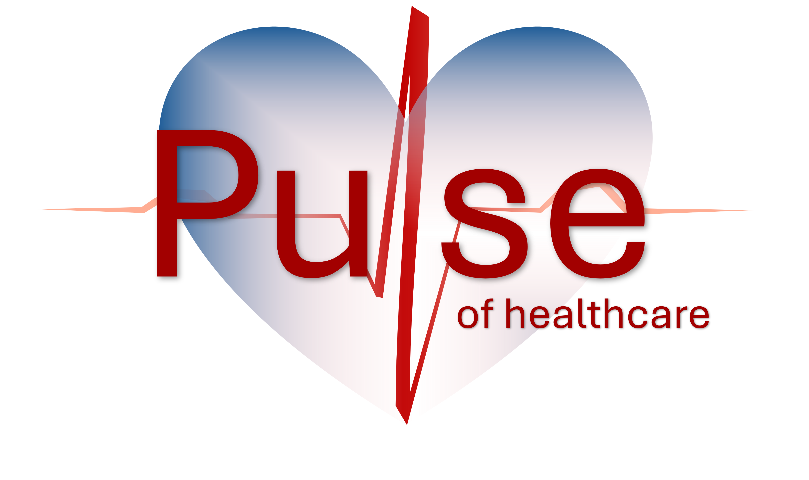

# AS24TeamPulse

<figure id = logo>
  
</figure>

#### Preamble - *Project AS2024*

This project aims to explore and implement innovative solutions to streamline healthcare processes through digital transformation, leveraging modern technologies to address real-world challenges in the industry. This project was enabled by the University of Applied Sciences and Arts Northwestern Switzerland (FHNW).

## Authors

The contributing members from the **AS24TeamPulse** team are listed in the [Table 1](#authors), detailing their names and contact information. 
|**Name**|**Email**|
|---|---|
|Andreas Braun Ponce de Leon|andreas.braunponcedeleon@students.fhnw.ch|
|Jetlinda Krasniqi|jetlinda.krasniqi@students.fhnw.ch|
|Joëlle Höchle|joelle.hoechle@students.fhnw.ch|
|Nicolas Bopp|nicolas.bopp@students.fhnw.ch|{authors}

## Supervisors

[Table 2](#supervisors) shows the names of the supervisors who provided guidance and expertise throughout the project within the context of healthcare digitalization.

|**Name**|**Email**|
|---|---|
|Andreas Martin| andreas.martin@fhnw.ch|
|Charuta Pande |charuta.pande@fhnw.ch|
|Devid Montecchiari |devid.montecchiari@fhnw.ch|{#supervisors}

## Project Description

As a Swiss healthcare insurance we automate the process of medication invoice receiving and processing. It includes the extraction of invoices from email attachments and checking different conditions for the payment approval or denial. Using a Large Language model the Client gets a generated decision letter, which ends the process.

# AS-IS Process
The current process is really  time intensive for the administrative assistant. For every invoice he or she has to check if the patient is a client, control if the medication has a valid GTIN Number. And in the end doing a risk evaluation based on the comparison to the official "Spezialitätenliste", which don't has a API interface now.

## Roles

Internal: 
- Employee: Administrative Assistant
- Higher Authority: Financial Controller

External: 
- External Healthcare provider
- Customer: Patient

## Workflow
The current state of cost approvals in the Swiss healthcare insurance system includes many tasks that are not yet automated. It requires significant effort and time until the process of medication cost validation is either accepted or denied. This state is modeled in [Figure 1](#figure-1) and can also be found as [`bpmn-model`](bpmn/pulse_as_is_process_final.bpmn).
The process starts with the Administrative Assistant of the insurance company receiving an email with an invoice attached. The assistant reads the invoice and checks the Clients Table to verify whether the person named in the invoice is a client of the insurance. 
The first gateway depicts two different scenarios:
- If the person is not a client, the assistant informs the healthcare provider about the invalid claim, and the process ends.
- If the client exists in the table, the assistant checks the external Swiss [Spezialitätenliste](https://www.xn--spezialittenliste-yqb.ch/) for the validity of the medication. If the medication is invalid, the healthcare provider is informed, and the process ends.
 
For valid medications, the process proceeds to the risk calculation stage **(MAYBE DECLARE IN DETAIL WHAT IS MEANT WITH RISK CALCULATION!!!!!!!!!).**
- If the risk is low, the assistant reviews the invoice and inserts the information into the Invoice Table in the database.
- If the risk is high, the process moves to the Financial Controller, who decides whether to approve or deny the case:
  - If approved, the invoice information is sent back to the assistant, who inserts the data into the Invoice Table.
  - If denied, a message is sent to inform the healthcare provider about the rejection, and the process terminates.

The best-case scenario is the approval of the invoice, which terminates the process after notifying the healthcare provider and sending the notification and invoice to the customer.

<figure id = asIs>
  
  <figcaption>As-Is BPMN model of the medication cost approval in the Swiss healthcare insurance company.</figcaption>
</figure>

As described in this workflow, there are many tasks for the Assistant, which could be automated and more efficient.

## Goal

The goal of this project is to make a faster and automized process of payment denials or approvals and calculations of medication invoices.

## Stakeholders

The main stakeholders is our insurance, particularly the administrative assistant, which gets a lot of support with the execution of repetitive, boring standard tasks. In addition the client benefits from a very fast process cycle, which he gets the feedback of the calculations and decisions. Lastly the doctor gets a really fast feedback, if there is a error in the invoice, with the description of the error.

## User Stories / Scenario / case

### Assistant

User Story 1: Administrative Assistant - Invoice Automation
As an Administrative Assistant at the insurance company,
I want the system to automatically process medication invoices from email attachments,
so that I can save time and focus on other administrative responsibilities.

Acceptance Criteria:

- The system fetches email attachments and identifies valid PDF invoices.
- PDF invoices are parsed into JSON objects with essential fields extracted (e.g., Client ID, medication, cost).
- Invalid or incomplete invoices are flagged with a reason and notification is sent back to the healthcare provider.

### Patient

User Story 2: Patient - Fast Response for Medication Approval
As a patient using the healthcare insurance,
I want to receive timely feedback on whether my medication cost is approved or denied,
so that I can manage my medical expenses without unnecessary delays.

Acceptance Criteria:

- Patients receive approval or denial letters via email within a predefined SLA (e.g., within 24 hours of invoice submission).
- Denial letters clearly explain the reason (e.g., non-member, medication not in list).
- Approval letters include details of the payment and next steps for reimbursement.

### Risk management

User Story 3: Financial Controller - Risk Escalation Management
As a Financial Controller,
I want to review high-risk medication invoices flagged by the system,
so that I can make informed decisions and ensure compliance with cost approval policies.

Acceptance Criteria:

- The system flags high-risk invoices based on predefined rules (e.g., medication abuse risk, high cost).
- Financial Controllers are notified and provided with all relevant invoice and medication details.
- Controllers can approve or deny the invoice, with the system generating a corresponding letter to the client.

# TO-BE Process

In this chapter the new innovations in automating the business processes are described. The goal is to reduce cost and save time in the approval process of our Swiss healthcare insurance company pulse. Providing insights of the workflow and automating of tasks. Additionally serving as a guidance for reproducibility. 

<figure id= ToBe>
  
  <figcaption>To-BE BPMN model of the medication cost approval in the Swiss healthcare insurance company.</figcaption>
</figure>

## Features

Key functionalities:
- Automatically fetches invoices from email attachments.
- Reads and parses text from invoice PDFs to JSON objects
- API for sending invoice data to camunda and starting of the process
- Stores data from patient, invoices and medications in a structured SQLite database.
- Storage of medication invoice in PDF format in Google Drive
- Supports integration with external systems like Deepnote and Make.com for automated workflows
- Generates and sends decision letters back to client

## Automated workflow
A new email to the address digibp.pulse.team@gmail.com initializes the process. In "make" the .pdf attachment of the email is parsed and the content forwarded to the Flask API on Deepnote. In Deepnote the invoice is inserted to the invoice table. This API triggers also the starting event of the Camunda workflow.

The first activity checks if the patient is a client of our healthcare insurance. Secondly the medication is compared with a subset of the Swiss "Spezialitätenliste". This returns the reference price of the medication. If the GTIN is invalid, or the patient is no client, it will sent a rejection message to the healthcare provider. 

After the first checks, a risk calculation is executed based on the price difference of the "Spezialitätenliste" compared to the invoice. Additionally there the patient has a risk-score which is relevant for drug abuse comparing the risk of the patient and if the drug is addictive.

If the risk is low, the assistant checks the invoice and if the risk is high, the financial controller checks the invoice. The controller can approve or reject the invoice. Based on the decision the e-mail will be sent to the healthcare provider and the client. All the messages are written by an LLM giving it the nessesary informations what to write. 

## Receiving E-Mail with "make"
In the [image](#makeReceive) below, the automated workflow in make is visualized, including the modules. The process starts with the Gmail module monitoring incoming emails. Afterwards the emails get filtered if the attachment of the email is a PDF. 

The PDF Files are routed to two actions, first uploaded directly to the digitbp.pulse.team@gmail.com Google Drive storage. This serves as a database for the ingoing invoices as a overview. The other path sends the PDF file to the PDF.co module. This module converts the information in the PDF file to a JSON format, which is then passed to the JSON module to make an JSON object out of these information, which is suitable for being sent to an API using the HTTP post request module.

<figure id = "makeReceive">
  
  <figcaption>make workflow pipeline</figcaption>
</figure>

## Forward to Deepnote
The make pipeline forwards the JSON object with a http request to Deepnote.
The API extract the information from the JSON object and creates an entry in the Invoice table. The extracted values from the JSON object are then send to the Camunda endpoint, which eventually starts the camunda [To be](#ToBe) process. 

<!-- <figure>
  
  <figcaption> Figure 3: PLACEHOLDER !!!!!!!!!!!!!!!!!!!!!!!!!!!!!!!!!!!!!!!!!!!!!!!!!!!!! </figcaption>
</figure> -->

## Camunda BPMN To Be Workflow
Finally arriving to the [To Be BPMN Workflow](#ToBe) in camunda. The Start is triggered by the HTTP request from Deepnote, introducing the model with the invoice parameter from the invoice from the email. After receiving the information of the invoice from the API as JSON objects, the system checks if the patient is a client from our healthcare insurance. If the patient is in our database, the information about the medication is fetched from the Medication table and checks if the medication exists.
When one check fails, a denial message is generated with an LLM giving the healthcare provider a overview, why the invoice cannot be proceed. 

## Camunda CMN Risk evaluation
**@Andy, please check!!!**

Furthermore there is a risk evaluation in where the invoice gets reviewed. For calculating the risk-benefit of the cost approval for the medication, and if the invoice is reasonable, the information undergoes an [Decision Table](#decision-table) to automate this task. If there is an high risk, the task is going to proceed to an higher authority, which checks the case manually and decide if the cost is approved or denied, with an LLM generated letter to the client. If the higher authority finds the invoice for reasonable or the decision is a low risk, the system sends a positive response generated by the LLM before ending.

**Add some Image**

## Flask API for external service tasks
**@nici please check**

<table width="1500" id="endpoints">
    <tr>
        <th width="100"><b>Endpoint</b></th>
        <th width="40"><b>Method</b></th>
        <th width="100"><b>Description</b></th>
        <th width="200"><b>Request Body</b></th>
        <th width="200"><b>Response</b></th>
    </tr>
    <tr>
        <td>/create_invoice</td>
        <td>POST</td>
        <td>Creates an invoice and starts a Camunda process</td>
        <td>
            <pre>
{   "insurance_number" : 12345678,
    "medication_GTIN" : 7680481641027,
    "date" : "12.12.2024",
    "biller_mail" : "digibp.pulse.peer@gmail.com",
    "total_amount" : "100 CHF" 
}
            </pre>
        </td>
        <td>
            <pre>
{
    "status": "success",
    "message": "Invoice created and process started",
    "process_instance_id": "id",
    "invoice_id": 12345678
}
            </pre>
        </td>
    </tr>
    <tr>
        <td>/check_client</td>
        <td>POST</td>
        <td>Checks if a client exists based on their insurance number</td>
        <td>
            <pre>
{
    "insurance_number": 12345678
}
            </pre>
        </td>
        <td>
            <pre>
{
    "found": true,
    "client": { ... }
}
            </pre>
        </td>
    </tr>
    <tr>
        <td>/check_medication</td>
        <td>POST</td>
        <td>Checks if a medication exists based on its GTIN</td>
        <td>
            <pre>
{
    "gtin": 7680481641027
}
            </pre>
        </td>
        <td>
            <pre>
{
    "found": true,
    "medication": { ... }
}
            </pre>
        </td>
    </tr>
    <tr>
        <td>/send_email</td>
        <td>POST</td>
        <td>Sends an email based on the invoice and reason provided</td>
        <td>
            <pre>
{
    "invoice_id": 12345678,
    "reason": "reason"
}
            </pre>
        </td>
        <td>
        <pre>-</pre>
        </td>
    </tr>
</table>

## Database
For this project, the medical billing and insurance management system, designed specifically for the Swiss healthcare environment, is represented in three tables, which are depicted in [Figure 4](#figure-4). The first table on the left describes the Medication table, which stores details about medications, including a unique identifier (GTIN), manufacturer, description, substances, public price, and a drug abuse risk indicator. Using the GTIN number, the Invoice table in the middle links to the Medication table. This table records invoice data, such as a unique invoice ID, an insurance number, a medication identifier, the date, the biller’s email, and the total amount. The Clients table on the right is linked to the Invoice table via the insurance number and holds information about the client, including first and last names, address details, email, and a risk score. 

<figure id = "databases">
  
  <figcaption>SQLite healthcare database for patient records, invoicing, and medication tracking.</figcaption>
</figure>

## Decision Table

### SL Decision Service
DMN-based decision service for medication validation that evaluates:

- Client eligibility and risk profile
- Price validation against published rates
- Drug abuse risk assessment

The service follows Switzerland's Spezialitätenliste (SL) rules for medication reimbursement approval.

#### Decision Flow
1. Validates client exists in system
2. Checks medication price against published rates based on SL
3. Evaluates risk based on client profile and medication abuse potential
4. Returns final approval based on all validations passing

#### Example of a high risk decision

<figure id = "highRiskDecision">
  
  <figcaption>Decision on high risk client.</figcaption>
</figure>

## LLM Generated Letters
For generating letters sent for cost approval or denial, a Large Language Model (LLM), specifically Zephyr 7B β by HuggingfaceH4, was trained (see [Deepnote.com](https://deepnote.com/workspace/Pulse-fec86550-0fb4-434a-b085-98ec6e3f16d5/project/Pulse-61e41b51-86e6-4811-87a3-550bb6414c02/notebook/Flask-API-2e1700317da443ed9c2cfcde4c9c98e1?utm_source=share-modal&utm_medium=product-shared-content&utm_campaign=notebook&utm_content=61e41b51-86e6-4811-87a3-550bb6414c02)).
If the process decides to approve the costs of the medication invoice, the LLM will generate an approval letter and send it via an API to Make.com, which automatically sends the letter to the client's email address using the Webhooks and Email modules.

Cost approval may be denied in the following cases:
- The client is not a member of our health insurance.
- The medication does not exist in our database.
- After a high-risk detection, a higher authority decides that the cost approval is not reasonable.

In each of the above cases, an individual denial letter will be generated using the LLM, clearly stating the reason for denial. After the letter is generated as a PDF, it will be sent to an API, which forwards it to Make using the Webhooks module. The Email module will then automatically send the denial letter to the client's email address (see [Figure below](#makeSend)).

<figure id = "makeSend">
  
  <figcaption>Send email to client</figcaption>
</figure>

## Limitations
The email **must** be completely empty and have the same format as the Swiss Tarmed invoices (use provided templates). 
Due to time issues the project is limited to medication that have the Tarif 402 (GTIN code), even though tarif positions in the Tarmed system are not specifecly defined. 
The module PDF.co in [Make](https://www.make.com/en) provides only limited tokens and expires on the 5th January 2025, and limited tokens (should be enough until it expires).
The Gmail module in [Make](https://www.make.com/en) expires on the 5th June 2025.

## Conclusion
In the project automated the medication invoice processing workflow for a fictional Swiss healthcare insurance company. By implementing automated email processing, PDF parsing, risk assessment, and LLM-generated decision letters, we significantly reduced manual workload for administrative staff while accelerating response times for clients. The integration of multiple technologies (Make, Camunda, Flask API) created a end-to-end automated solution.

## Tools used:
- [Make](https://www.make.com/en)
- Camunda 7
- [Deepnote (Python 3.9)](https://deepnote.com/workspace/Pulse-fec86550-0fb4-434a-b085-98ec6e3f16d5/project/Pulse-61e41b51-86e6-4811-87a3-550bb6414c02/notebook/Database-Creation-and-Population-888ec597bf47454587ad51d22219648e?utm_source=share-modal&utm_medium=product-shared-content&utm_campaign=notebook&utm_content=61e41b51-86e6-4811-87a3-550bb6414c02)
- Google Mail
- [Google Drive](https://drive.google.com/drive/folders/1zbCjgil0v--oFb20nrZZ77zMGt39m_4o?usp=sharing)
- Google Cloud Platform: Projectnr. 49695570445 
  (log in with the provided email in the [chapter Setup Instructions](#Setup-Instructions))
- [Flask (for API/ Webhooks integration)](https://deepnote.com/workspace/Pulse-fec86550-0fb4-434a-b085-98ec6e3f16d5/project/Pulse-61e41b51-86e6-4811-87a3-550bb6414c02/notebook/Flask-API-2e1700317da443ed9c2cfcde4c9c98e1?utm_source=share-modal&utm_medium=product-shared-content&utm_campaign=notebook&utm_content=61e41b51-86e6-4811-87a3-550bb6414c02)
- [SQLite database](https://deepnote.com/workspace/Pulse-fec86550-0fb4-434a-b085-98ec6e3f16d5/project/Pulse-61e41b51-86e6-4811-87a3-550bb6414c02/notebook/Database-Creation-and-Population-888ec597bf47454587ad51d22219648e?utm_source=share-modal&utm_medium=product-shared-content&utm_campaign=notebook&utm_content=61e41b51-86e6-4811-87a3-550bb6414c02)
- PDF.co
- LLM: [Zephyr 7B β](https://huggingface.co/HuggingFaceH4/zephyr-7b-beta)

## Setup Instructions
Step-by-step guide to set up the project locally:

For this project the following email address was created and used as our healthcare insurace mail: digitbp.pulse.team@gmail.com 
The password is provided in [Moodle](https://moodle.fhnw.ch/mod/assign/view.php?id=2442058).
- [Run Deepnotes Server](https://deepnote.com/workspace/Pulse-fec86550-0fb4-434a-b085-98ec6e3f16d5/project/Pulse-61e41b51-86e6-4811-87a3-550bb6414c02/notebook/Flask-API-2e1700317da443ed9c2cfcde4c9c98e1?utm_source=share-modal&utm_medium=product-shared-content&utm_campaign=notebook&utm_content=61e41b51-86e6-4811-87a3-550bb6414c02)
- Send empty email with an PDF invoice to our address with an PDF attachement of an Swiss invoices from Tarmed (invoices are provided in [patient_invoices folder](https://deepnote.com/workspace/Pulse-fec86550-0fb4-434a-b085-98ec6e3f16d5/project/Pulse-61e41b51-86e6-4811-87a3-550bb6414c02/notebook/Flask-API-2e1700317da443ed9c2cfcde4c9c98e1?utm_source=share-modal&utm_medium=product-shared-content&utm_campaign=notebook&utm_content=61e41b51-86e6-4811-87a3-550bb6414c02))
- Deploy Camunda (Link to BPMN model!!!!!!!!!!!!!!!!!!!)

## Knowledge Base 
https://www.gs1.ch/en/industries/healthcare/pharmaceuticals

https://www.bag.admin.ch/bag/en/home/versicherungen/krankenversicherung/krankenversicherung-leistungen-tarife/Arzneimittel.html

### Useage of AI
AI (particularly Claude, ChatGPT and DeepL) was used as support for coding, writing and developing this solution. 
Despite the support, our team has dedicated significant effort to developing this result.

